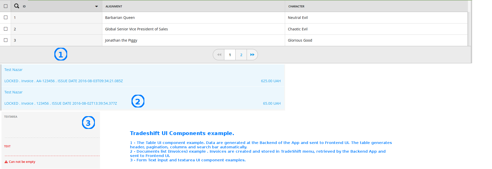
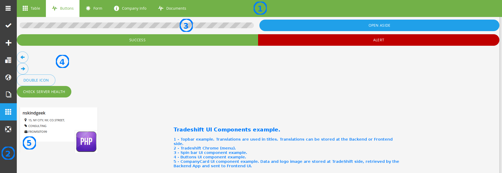

# tradeshift-app-samples

This repository contains sample projects and starter templates for building Apps for the Tradeshift Platform.  Additional documentation about how to build these apps is available at our [Apps site](http://apps.tradeshift.com).

Currently, there are three sample apps available:
* [Java - Spring.Boot and Spring Security](java-springboot)
* [JavaScript - Node.js/Express](javascript/nodejs)
* [PHP - Symphony Apps](php-symfony)

| Feature   | Java Spring.boot | Node.js | PHP
| -------  |  -------   | -----------   | -----------
| OAUTH2 Connection | X | X | X
| Authorization with Tradeshift Servers using OAUTH2 three-legged approach ([docs](http://apps.tradeshift.com/developers/documentation/#app-authentication))  | X | X | X
| Tradeshift APIs - getting documents | X | | X
| Tradeshift APIs - getting user information |  | X | X
| Angular.js frontend talking to RESTful backend  | X | X | X
| Using [Tradeshift's UI Components](http://ui.tradeshift.com), including table and tabs  | X | X | X
| i18n support on the client side  | X | X | X
| i18n support on the server side  | X | X | X
| Check health function for monitoring  | X | X | X
| Front-end basic test to get you started  | X | X | X
| Back-end basic test to get you started  | X | X |
| Tasks Service Example  | X |  |  
| Webhooks Example  | X |  |  

## Back-end REST API

| Request | Description | Java Spring.boot | Node.js | PHP
| --------|------- | ---- | ---- | ----
| GET /document/documents | invoice documents (calls TS API) | X | | X
| GET /account/info | company info (calls TS API) | | X | X
| GET /demo/grid-data | sample data for table | X | X | X
| GET /health | Healthcheck | X | X | X
| GET /locale | Server-side i18n| | X | X
| GET /locale/translations | Server-side Translation strings | | | X

The sample apps all aim to show same things, and the Front-end code talking to different Back-ends is almost identical:

The apps are designed to be hosted on any service. We tested these Apps on Heroku.

More information about creating Apps on Tradeshift is available in our [developer documentation] (http://apps.tradeshift.com/documentation).  

Any feedback is welcome - please let us know at email apps at tradeshift dot com.  
